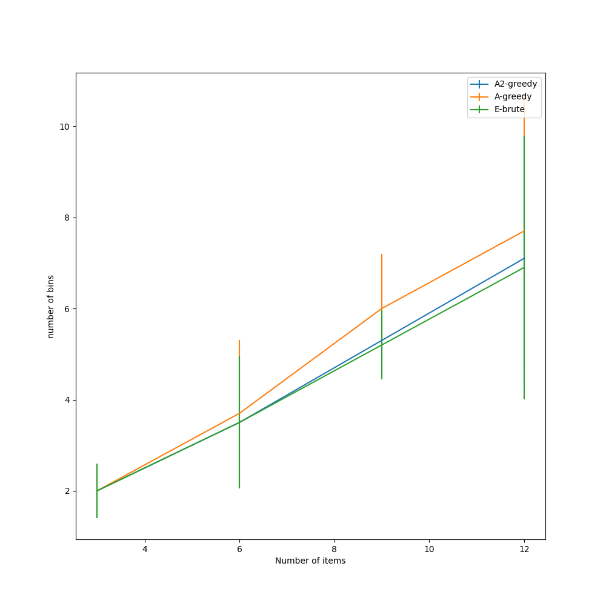
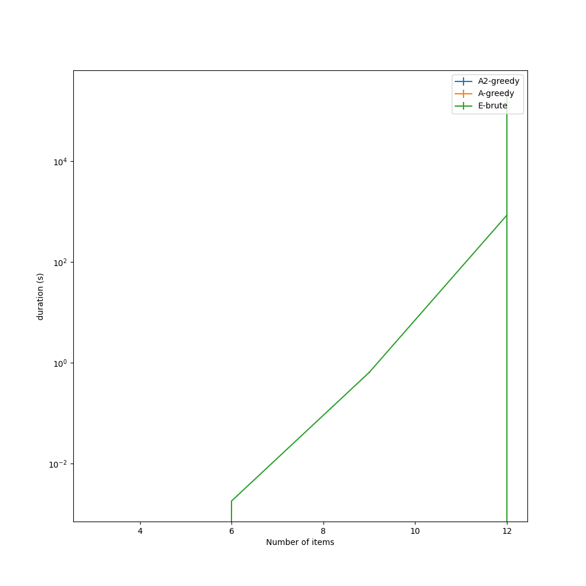
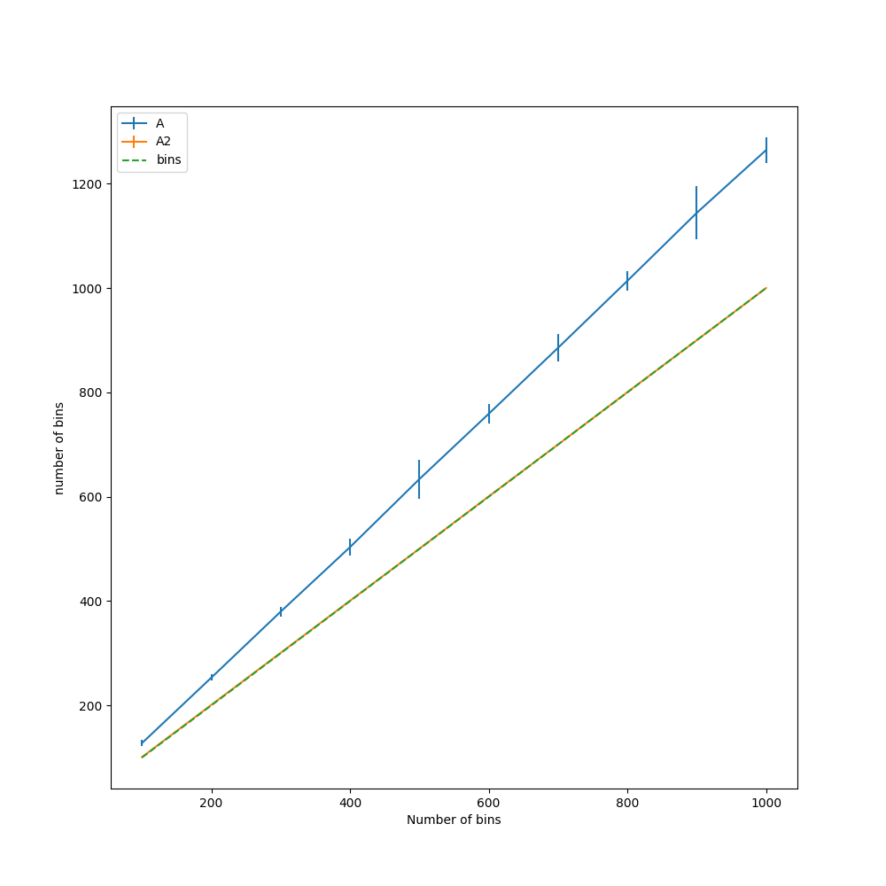

# Trabajo Práctico 2: Problema de Empaquetamiento

> Mis alumnos son los mejores :)
> Mis alumnos son los mejores :)

## Integrantes

- 105774 - Nicolas Zulaica - nzulaica@fi.uba.ar
- 104007 - Lautaro Barrionuevo - lebarrionuevo@fi.uba.ar

## Definición del problema

Dado un conjunto de n objetos cuyos tamaños son {T1, T2, · · · , Tn}, con Ti ∈ (0, 1], se debe empaquetarlos usando la mínima cantidad de envases de capacidad 1.

## Ejecución

```bash
python3 .\tdatp.py E|A|A2 <items_file>
```

> Ejemplo: `python3 .\tdatp.py E .\data\items_10.txt`

## Demostración que el problema de empaquetamiento es NP-Completo

Para demostrar que un problema es NP-Completo primero debemos demostrar que ese mismo problema sea NP. Es decir, que haya una solución que podamos revisarla en tiempo polinomial.

#### Demostracion de NP

Se debe poder demostrar que una solucion propuesta es _correcta_ en tiempo polinomial.

Dado un arreglo de paquetes con sus items asignados podemos:

- Verificar que los items de la solucion sean los items del problema.
  > Podriamos tener una copia de los items del problema y removerlos a medida que recorremos la solucion.
  > O(N^2)
- Verificar que la capacidad de cada paquete sea menor o igual a 1.
  > Podriamos recorrer cada paquete y verificar que la suma de los items sea menor o igual a 1.
  > O(N)

#### Demostracion de NP-Completo

Luego debemos poder reducir otro problema NP-Completo a este. Vamos a utilizar el problema de 3-Partition.
La demostración de que dicho problema es NP-Completo se puede encontrar en la bibliografía de [Complexity Results for Multiprocessor Scheduling under Resource Constraints](https://epubs.siam.org/doi/abs/10.1137/0204035)

> 3-Partition: Dados 3n numeros, pueden dividirse en 3 conjuntos de igual suma ?

En nuestro problema, como hemos mencionado anteriormente, tenemos que saber diferenciar el problema de optimización y el de decisón. Para la reducción tomamos el problema booleano que se plantea como "Se pueden empaquetar todos los elementos de un conjunto en k envases de tamaño 1".

Vamos a definir que en nuestro problema tenemos un conjunto {T1, T2,......, Tn} donde cada elemento tiene un tamaño existente en (0,1] y se deben empaquetar los elementos del conjunto en k envases donde cada envase tiene una capacidad de 1.

Ahora si para reducir el problema de 3-Partition deberiamos primero normalizar los valores del conjunto entre 0 y 1 ya que el problema mencionado trabaja con enteros positivos. Si consideramos k=n/3 podemos ingresar el problema de 3-Partition de manera analoga para obtener la respuesta de si es posible empaquetar los elementos en a lo sumo k envases.

## Implementaciones

El codigo de las implementaciones puede encontrarse en el archivo `packing.py`

### Implentación Aproximada Propuesta (A)

Itera los elementos, agregandolos al ultimo envase si este tiene espacio, o creando uno nuevo en caso contrario.

Complejidad: `O(N)`

> Ya que itera los N elementos una sola vez

Aproximacion: `2`

> En el peor de los casos tendremos elementos con el siguiente formato: [m,M,m,M,...,m,M],
> donde hay 2N elementos, m+M > 1 y m\*N < 1.
>
> - la heuristica propuesta creara 2N envases (uno con cada elemento)
> - la solucion optima creara N (uno por cada elemento M y uno con todos los m)

### Implentacion Aproximada Propia (A2)

Mientras haya elementos disponibles, los itera intentando agregarlos al envase actual (removiendolos de los elementos disponibles), si no entra ninguno crea un nuevo envase.

Complejidad: `O(N^2)`

> Ya que en cada pasada itera todos los elementos disponibles, pudiendo haber hasta N pasadas

Aproximacion: `3/2`

> En el peor de los casos, se conforma un paquete utilizando 2 elementos mas pequeños que podrian haberse emparejado con elementos mas grandes que ahora ocupan un paquete individualmente
>
> Eg: [0.5, 0.4, 0.5, 0.6] -> [ [0.5, 0.4], [0.5], [0.6] ] ( podemos pensar en estos elementos como agrupaciones de elementos mas pequeños )

### Implentación Exacta (E)

Evalua la heuristica A para cada permutacion de los elementos.

Complejidad: `O(N!)`

> Ya que hay N! permutaciones de N elementos

### Comparacion con algoritmo exacto

Para cada `N` cantidad de elementos:

- Se generan `M` conjuntos de `N` elementos aleatorios
- Se ejecutan las 3 implementaciones para cada conjunto
- Se calcula el promedio y desvio de la cantidad de paquetes y el tiempo de ejecucion

> Podemos encontrar el codigo que genera las estadiasticas en el archivo `stats.py`

|                 Cantidad de paquetes                 |              Tiempo de ejecucion              |
| :--------------------------------------------------: | :-------------------------------------------: |
|  |  |

> Incluso con una cantidad baja de elementos, el algoritmo exacto es muy costoso, mientras que el tiempo de ejecucion de las aproximaciones es despreciable para la cantidad de elementos que se estan evaluando.
> Evaluar las aproximaciones con tan pocos elementos no tiene sentido, por lo que se realiza en la siguiente seccion.

### Evaluacion de aproximaciones

Para cada `E` cantidad de envases:

- Se generan `M` conjuntos de items aleatorios que ocupen exacta y completamente `E` envases
- Se ejecutan ambas aproximaciones para cada conjunto
- Se calcula el promedio y desvio de la cantidad de paquetes y el tiempo de ejecucion

> Podemos encontrar el codigo que genera las estadiasticas en el archivo `stats2.py`
> La generacion de los conjuntos de items (`generate_items_for_bins`) se encuentra en el archivo `generate_items.py`

#### Cantidad de paquetes

|                        <100 bins                         |                        >100 bins                         |
| :------------------------------------------------------: | :------------------------------------------------------: |
|  |  |

> Observamos que en el promedio, las aproximaciones son mejores que su peor caso (2 y 3/2 respectivamente).
> La aproximacion A suele ser un 30% peor que la optima, mientras que la A2 solo difiere en 1 elemento.

#### Tiempo de ejecucion

|                     <100 bins                     |                     >100 bins                     |
| :-----------------------------------------------: | :-----------------------------------------------: |
|  |  |

> Observamos claramente la tendencia lineal de A y la cuadratica de A2.
